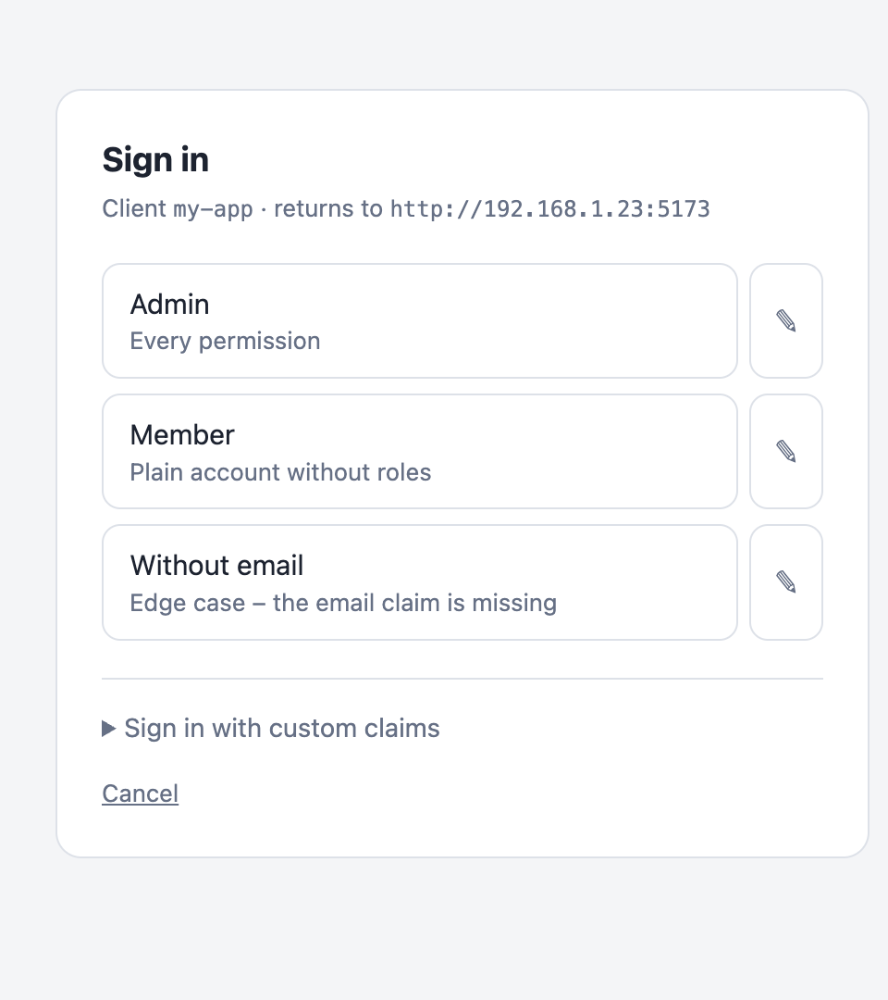
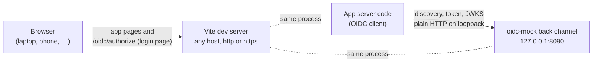

# oidc-mock

**A fake OpenID Connect provider for local development – users in a YAML file, one click to sign
in, and a Vite plugin that keeps login working on your phone.**

<p align="center">
  <picture>
    <source media="(prefers-color-scheme: dark)" srcset="docs/login-dark.png">
    
  </picture>
</p>

Developing against a real identity provider means test accounts, passwords and a network
connection. Most mocks fix that but bring their own friction: they run in Docker, you paste claims
into a text field on every login, and they break the moment you open your app on another device.

oidc-mock is a small Node package instead:

- **Users are a YAML file.** Every user has a stable `sub` and whatever claims your app expects –
  roles, groups, tenant IDs, any JSON shape. Check the file in, and the whole team signs in as the
  same “Admin” or “Member without email”.
- **One click to sign in.** The login page shows a button per user. Need a variation? The ✎ next
  to a user opens their claims as JSON, ready to edit, without touching the file.
- **Edits apply live.** Change a claim in the YAML and the next login – or even the next token
  refresh – carries it. No restart.
- **Runs inside Vite.** `vite --host`, a phone on the LAN, a forwarded port, a dev container: the
  login page is served by your dev server, so it works wherever your app works.
- **Real OIDC.** Discovery, signed RS256 JWTs, JWKS, authorization code flow with PKCE, refresh
  tokens, userinfo, introspection, logout. Your app uses its normal OIDC client and the same code
  path as in production.

> [!WARNING]
> This is a development tool. Anyone who can reach it can sign in as anyone, with any claims.
> Never expose it to the internet or ship it to production.

## Contents

- [Quick start](#quick-start)
- [Configuration](#configuration)
- [Why a Vite plugin: `--host`, phones and HTTPS](#why-a-vite-plugin---host-phones-and-https)
- [Recipes](#recipes)
- [Endpoints](#endpoints)
- [Programmatic use and tests](#programmatic-use-and-tests)
- [Compared to other mocks](#compared-to-other-mocks)
- [Development](#development)

## Quick start

oidc-mock is not on npm yet. Install it from GitHub – the package builds itself on install:

```sh
npm i -D github:strehk/oidc-mock
npx oidc-mock init            # writes an example oidc-mock.yaml
```

### With Vite (SvelteKit, Nuxt, Astro, Remix, plain Vite, …)

```ts
// vite.config.ts
import { defineConfig } from 'vite';
import { sveltekit } from '@sveltejs/kit/vite';
import { oidcMock } from 'oidc-mock/vite';

export default defineConfig({
	plugins: [oidcMock(), sveltekit()]
});
```

On `vite dev` the plugin prints the discovery URL. Give it to your OIDC client as issuer or
authority, with any client ID:

```sh
# .env
OIDC_AUTHORITY=http://127.0.0.1:8090/oidc/.well-known/openid-configuration
OIDC_CLIENT_ID=my-app
```

The plugin only runs in `vite dev` and `vite preview`, never in `vite build`.

| Option             | Default            | Description                                                                                          |
| ------------------ | ------------------ | ---------------------------------------------------------------------------------------------------- |
| `config`           | `'oidc-mock.yaml'` | Path to the YAML file, relative to the Vite root                                                     |
| `port`             | from the YAML      | Overrides `port`                                                                                     |
| `rewriteRedirects` | `true`             | Rewrite redirects to the mock into relative ones ([why](#why-a-vite-plugin---host-phones-and-https)) |
| `preview`          | `true`             | Also run in `vite preview`                                                                           |

### Standalone

For anything that is not Vite – Next.js, Express, a Python backend, a mobile app:

```sh
npx oidc-mock                           # reads ./oidc-mock.yaml
npx oidc-mock -c dev/oidc.yaml -p 9000 -H 0.0.0.0
```

```
oidc-mock listening – 3 users from /path/to/oidc-mock.yaml
  issuer:    http://127.0.0.1:8090/oidc
  discovery: http://127.0.0.1:8090/oidc/.well-known/openid-configuration
```

In this mode the browser talks to the mock directly, so it has to reach `host:port`.

## Configuration

A complete file with every option and its default:

```yaml
# Where the provider listens (the “back channel”, see below).
# The issuer is http://<host>:<port><base_path>.
host: 127.0.0.1
port: 8090
base_path: /oidc

# Set this only when the mock sits behind a proxy under another URL.
# issuer: https://auth.dev.example.org/oidc

# Signing key, generated on first start. Relative to this file.
key_file: node_modules/.cache/oidc-mock/signing-key.json

# Without `clients`, every client_id is accepted without a secret.
clients:
  - client_id: my-app                   # public client, PKCE
    redirect_uris: ['http://*:5173/*', 'https://*:5173/*']
  - client_id: backend
    client_secret: dev-secret           # confidential client
    # no redirect_uris: anything goes

tokens:                                 # seconds, or 30s / 15m / 1h / 30d
  access_token_ttl: 1h
  id_token_ttl: 1h
  refresh_token_ttl: 30d

# The “custom claims” box on the login page.
custom_login: true

users:
  - sub: admin                          # required, unique, becomes the `sub` claim
    label: Admin                        # button text; default: name, then email, then sub
    description: Every permission       # second line on the button
    claims:                             # anything; goes into id token, access token and userinfo
      email: admin@example.org
      email_verified: true
      given_name: Ada
      family_name: Admin
      roles: [admin]
```

What to know about claims:

- **Anything goes.** Claims are copied verbatim, so an array of strings, an array of objects or a
  nested map all work. The [recipes](#recipes) show the shapes of common providers.
- **The same claims everywhere.** The id token, the access token and `/userinfo` all carry the
  full set, so it does not matter where your app reads a claim from.
- **Protected claims.** `iss`, `sub`, `aud`, `exp`, `iat`, `nbf` and `jti` are set by the mock. If
  a user's claims contain them, they are ignored.

What reloads without a restart:

- **Live:** `users`, `clients`, `tokens` and `custom_login`. The file is checked on every request.
  A broken file logs an error and keeps the last good config.
- **Needs a restart:** `host`, `port`, `base_path`, `issuer` and `key_file`. A warning tells you
  when one of them changed.

Refresh tokens remember which user they belong to. For a user from the file, a refresh re-reads
their claims, so you can take away a role and watch the app react without logging out.

## Why a Vite plugin: `--host`, phones and HTTPS

An OIDC client discovers its provider once, on the server, and from then on sends the browser to
the `authorization_endpoint` from that discovery. With a mock at `http://127.0.0.1:8090` that
breaks in several everyday situations:

- **`vite --host` and a phone on the LAN.** The phone opens `http://192.168.1.23:5173` and gets
  redirected to `http://127.0.0.1:8090/…` – which is the phone itself.
- **Mock in Docker, dev server somewhere else.** Remote dev boxes, Codespaces, SSH port forwards:
  you forwarded the app's port, but not the mock's.
- **HTTPS dev server.** A self-signed or mkcert certificate is fine for the browser, but a
  server-side fetch from Node to `https://localhost:5173` fails certificate validation.

The Vite plugin splits the provider into two channels:



- **Back channel.** Discovery, token, JWKS, userinfo and introspection run on a loopback port over
  plain HTTP. Only your app's server calls them, so HTTPS certificates and host names never
  matter here.
- **Front channel.** The Vite server serves the same endpoints under `base_path`. The browser only
  ever needs the login page and the logout endpoint, and those come from wherever it loaded your
  app from.
- **Redirect rewriting.** When your app redirects to `http://127.0.0.1:8090/oidc/authorize?…`,
  the plugin rewrites the `Location` header to `/oidc/authorize?…`. The browser stays on
  `192.168.1.23:5173`, and since your OIDC client builds `redirect_uri` from the request host, it
  comes back there as well.

Your app code does not change. Only its authority URL points at the mock.

> [!NOTE]
> Vite refuses unknown host names by default. If you open the dev server by host name instead of
> by IP (e.g. `my-laptop.local`), add it to
> [`server.allowedHosts`](https://vite.dev/config/server-options#server-allowedhosts).

## Recipes

### Role claims in the shape of your production provider

Keep the claims shaped like production, so the same parsing code runs in dev:

```yaml
users:
  # Logto: an array of role objects
  - sub: logto-admin
    claims:
      email: admin@example.org
      roles: [{ name: admin }]

  # Zitadel: a map keyed by role, then by organisation
  - sub: zitadel-admin
    claims:
      email: admin@example.org
      'urn:zitadel:iam:org:project:roles':
        admin: { '123456789': example.org }

  # Keycloak: realm roles
  - sub: keycloak-admin
    claims:
      email: admin@example.org
      realm_access: { roles: [admin] }

  # Auth0 / Entra style: namespaced string array
  - sub: groups-admin
    claims:
      email: admin@example.org
      'https://example.org/groups': [admins, staff]
```

### Edge cases as permanent presets

The users you only test once a year are the ones that break. Make them one click away:

```yaml
users:
  - sub: no-email
    label: Without email
    description: Provider did not release the email scope
    claims: { given_name: Nora }

  - sub: unverified
    label: Unverified email
    claims: { email: new@example.org, email_verified: false }

  - sub: unicode
    label: Ünïcödé name
    claims: { email: zoe@example.org, given_name: Zoë, family_name: Ó Súilleabháin-Müller }

  - sub: no-roles
    label: Roles claim missing
    claims: { email: plain@example.org }
```

### Logging in from a script or `curl`

The login page is a plain HTML form, so a script can sign in without a browser. Send the hidden
`params` field back unchanged and name a user:

```sh
# 1. Start a login in your app and grab the redirect to the mock
AUTH=$(curl -s -c jar -o /dev/null -w '%{redirect_url}' http://127.0.0.1:5173/login)
# 2. Read the hidden params field from the login page
PARAMS=$(curl -s "$AUTH" | sed -n 's/.*name="params" value="\([^"]*\)".*/\1/p' | head -1 \
  | sed 's/&quot;/"/g; s/&#39;/'"'"'/g; s/&lt;/</g; s/&gt;/>/g; s/&amp;/\&/g')
# 3. Pick a user; the response redirects back to your app with a code
curl -s -o /dev/null -w '%{redirect_url}' "${AUTH%%\?*}" \
  --data-urlencode "params=$PARAMS" --data-urlencode "sub=admin"
```

Then open the returned URL with the same cookie jar (`curl -b jar -c jar …`) to finish the login
in your app. For custom claims, send `custom=1`, `custom_sub=…` and `custom_claims=<json>` instead
of `sub`.

## Endpoints

All below the issuer, e.g. `http://127.0.0.1:8090/oidc`:

| Path                                | Supports                                                                                                                                  |
| ----------------------------------- | ----------------------------------------------------------------------------------------------------------------------------------------- |
| `/.well-known/openid-configuration` | discovery; `/.well-known/oauth-authorization-server` too                                                                                  |
| `/jwks`                             | the RS256 public key                                                                                                                      |
| `/authorize`                        | `response_type=code`; PKCE `S256` and `plain`; `state`, `nonce`; `prompt=none` answers `login_required`; RFC 9207 `iss` in the response |
| `/token`                            | `authorization_code`, `refresh_token`; client auth `none`, `client_secret_basic`, `client_secret_post`                                    |
| `/userinfo`                         | `GET` and `POST`, bearer token                                                                                                            |
| `/introspect`                       | access, refresh and id tokens                                                                                                             |
| `/revoke`                           | accepts and ignores                                                                                                                       |
| `/end_session`                      | redirects to `post_logout_redirect_uri` with `state`, or shows a “signed out” page                                                        |

What the tokens contain:

- **`id_token`:** issued when the scope contains `openid`.
- **`refresh_token`:** issued when the scope contains `offline_access`.
- **Access token:** a JWT (`typ: at+jwt`) with the client ID as audience, so clients that verify
  it locally against the JWKS work as well.
- **Codes:** single-use, valid for two minutes.
- **CORS:** open on all JSON endpoints, so browser-only SPAs can call the token endpoint directly.

What is deliberately missing: implicit and hybrid flows, client credentials, device flow, dynamic
client registration, `request` objects, encrypted tokens and consent screens. If you need one of
them, open an issue.

## Programmatic use and tests

```ts
import { startServer } from 'oidc-mock';

const mock = await startServer({
	inline: {
		port: 0, // pick a free port
		users: [{ sub: 'alice', claims: { email: 'alice@example.org', roles: ['admin'] } }]
	}
});

mock.issuer; // http://127.0.0.1:54321/oidc
mock.discoveryUrl; // …/.well-known/openid-configuration
await mock.close();
```

`startServer({ config: 'path/to/oidc-mock.yaml' })` loads a file instead. To mount the provider
in an existing server, `createProvider()` returns an object whose
`handle(req, res): Promise<boolean>` works with `node:http`, Express and Connect.

## Compared to other mocks

| Mock                                                                      | Login page                        | Config                 | Runs in                |
| ------------------------------------------------------------------------- | --------------------------------- | ---------------------- | ---------------------- |
| **oidc-mock**                                                             | one click per user, editable      | YAML, live reload      | Node / Vite dev server |
| [navikt/mock-oauth2-server](https://github.com/navikt/mock-oauth2-server) | text field for JSON claims        | JSON env var           | JVM / Docker           |
| [oauth2-mock-server](https://github.com/axa-group/oauth2-mock-server)     | none, approves every request      | code, event hooks      | Node                   |
| [oidc-provider](https://github.com/panva/node-oidc-provider)              | username only                     | code, many options     | Node                   |
| [Soluto/oidc-server-mock](https://github.com/Soluto/oidc-server-mock)     | username and password             | JSON / YAML            | .NET / Docker          |
| [Dex](https://dexidp.io)                                                  | username and password             | YAML, no custom claims | Go / Docker            |

For automated tests without a browser, `oauth2-mock-server` is a fine choice. oidc-mock is meant
for the times a human clicks through the app.

## Development

```sh
bun install
bun test          # end-to-end with openid-client, plus the Vite plugin behind a foreign host
bun run dev       # CLI with examples/oidc-mock.yaml, restarts on change
bun run typecheck
bun run build     # → dist/, also runs on install from GitHub
```

The runtime needs Node 20 or later. Bun is only used for development. The dependencies are
[`jose`](https://github.com/panva/jose), [`yaml`](https://github.com/eemeli/yaml) and
[`zod`](https://zod.dev).

## License

MIT
